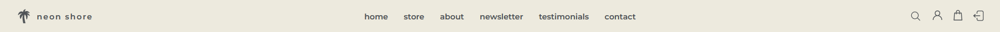

# neon shore

[neon shore - Live Website](https://neon-shore-a156870f9760.herokuapp.com/)

  

neon shore is a B2C merchandise store belonging to my dear friend, an artist who goes by [expuella](). As it stands, it's just a prototype and proof of concept but there are plans to get this up and running the future. In the interest of privacy and safety, her real name will be disclosed and she will instead be referred to solely by her alias. I've worked with expuella in the past and currently help her with business inquiries, as well as managing Pixiv and Weibo on her behalf. [Pixiv]() is an imageboard/gallery that's extremely popular in Japan, and [Weibo]() is a micro-blogging alternative to Twitter in China.

This is my fifth and final milestone project as part of Code Institute's Diploma in <strong>Software Development (E-commerce Applications)</strong>.

This project was my idea as opening up a store is something we've spoken about in the past but have never done anything about due to how much time and effort it would require. This is not to mention maintainence and fulfilling orders without a dedicated staff. Having said that, this e-commerce project was the perfect opportunity to take this idea and begin working on it.

Many artists have merchandise stores but they're often created using services like [Shopify]() and full-on storefronts like [etsy]() and these services take a percentage of the profits from the artist. [INPRNT]() is a very popular choice for artists to sell prints of their artwork as INPRNT handles the printing and shipping of the prints once the art is uploaded, however the profit split is a whopping 50:50. Expuella herself also uses INPRNT and has expressed her distaste in staying with them.

Knowing this, I decided to craft an e-commerce website around expuella's vision of "neon-shore", which is a name she chose for the business side of things when she was much younger and it has stuck with her since. neon-shore speaks of expuella's love for tropical settings, beaches in particular, in combination of a neon colour palette. As such, I wanted the design and UI of this website to represent that, hence I asked expuella to work with me as my client and approve my designs and decisions.

For the purpose of this project, expuella will also be referred to as the client It will be my goal to facilitate and actualise her vision of her business.

## Table of Contents

1. [neon shore](#neon-shore)
2. [Planning Phase](#planning-phase)
    - [Strategy](#strategy)
      - [Site Aims](#site-aims)
      - [Opportunities ](#opportunities)
    - [Scope](#scope)
3. [User Experience](#user-experience)
    - [Target Audience](#target-audience)
    - [User Stories](#user-stories)
4. [User Interface](#user-interface)
    - [Design Philosophy](#design-philosophy)
      - [Colours](#colours)
      - [Typography](#typography)
    - [Wireframes](#wireframes)
    - [Database](#database)
5. [Agile Development Process](#agile-development-process)
6. [E-commerce Application Type](#e-commerce-application-type)
7. [Marketing Strategy](#marketing-strategy)
8. [Business Plan](#business-plan)
9. [Features](#features)
    - [Logo](#logo)
    - [Landing Page](#landing-page)
    - [Navigation Menu - New User](#navigation-menu-new-user)
    - [Navigation Menu - Registered User](#navigation-menu-registered-user)
    - [Button](#button)
    - [About](#about)
    - [Register](#register)
    - [Login](#login)
    - [Forgot Your Password](#forgot-your-password)
    - [Logout](#logout)
    - [Dashboard](#dashboard)
    - [Change Your Password](#change-your-password)
    - [Roster List](#roster-list)
    - [Create Roster](#create-roster)
    - [Edit Roster](#edit-roster)
    - [View Roster](#view-roster)
    - [Delete Roster](#delete-roster)
    - [Error 404](#error-404)
    - [Error 505](#error-500)
    - [Favicon](#favicon)
10.  [Code](#code)
    - [Commits](#commits)
11. [Testing]
12. [Future Updates](#future-updates)
13. [Deployment](#deployment)
14. [Technologies Used](#technologies-used)
    - [Languages](#languages)
    - [Tools](#tools)
15. [Credits](#credits)
16. [Acknowledgements](#acknowledgements)

## Planning Phase

### Strategy

#### Site Aims

While a merchandise store may not seem like a good choice for a business, especially with there being so many alternatives between websites like [Redbubble](), [eBay](), and so on, avid fans of art and certain series enjoy to show their support of an artist and their works by purchasing their works. It's my belief that as much as possible of this should go to the sole creator of these works, the original artist. Art is often stolen, used, and printed without permission, and this is an unfortuante truth of the internet. As such, I'd like to bring as much attention and money to the original artists themselves.

Often times, people are more than happy to show their support towards their favourite artist and their works by purchasing prints, which are easy to ship, store, and display. Smaller pieces of merchandise like charms, pins, and stickers are also very popular as they're both cheap and easier to display as they use less room real-estate. Artbooks are also quite popular as they tend to be relatively inexpensive and a very sought-out collector's item, especially for those interested in collecting artbooks.

This site aims to act as a prototype for my client to show her what an e-commerce store would look and function like, while providing a simple, clean, and easy-to-use interface for both clients and admins.

#### Opportunities

The following was an extensive list of features that were brainstormed between expuella and I during the conceptualisation of the website. A feasibility chart was deemed important to prioritise the scope of the intended strategy.

| Opportunity             | Importance  | Feasibility   |
|------------------------ |------------ |-------------  |
| User Account      | 5           | 5             |
| Stripe Payments           | 5           | 5             |
| Landing Page            | 5           | 5             |
| Account Management              | 5           | 5             |
| About Page              | 3           | 5             |
| User Profile            | 5           | 5             |
| Product Management  | 5           | 5             |
| Checkout System          | 5           | 5             |
| Order History   | 5           | 5             |
| Flash Messages             | 5           | 5             |
| Testimonials             | 3           | 4             |
| Contact Page             | 5           | 5             |
| Social Media             | 5           | 5             |
| Different Currencies             | 3           | 1             |
| Promotions             | 3           | 1             |
| Related Products             | 2           | 2             |
| FAQ Page             | 3           | 3             |
| E-mail Confirmation             | 5           | 5             |
| Order Status             | 3           | 1             |
| Trustpilot Reviews             | 4           | 1             |
| Newsletter             | 3           | 3             |
| **Total**               | **87**      | **80**        |

Feasibility is based on time and my current level of ability using languages.

### Scope

As there is an imbalance of 5 points in the above score, (87 vs 80), there will have to be trade-offs made due to the tight schedule of this project.

The above table has been further categorised in order to establish a clear vision of the MVP required while satisfying the above requirements.

UX **Must's**:
  - User can login, logout, and register
  - User can checkout
  - User can use Stripe to carry out payment
  - User can recieve a confirmation email
  - User can view products
  - User can view their order history
  - User can access a store's Social Media
  - User can change and/or reset their passwords
  - User can access their profile
  - User can see feedback for their actions

- UX **Should's**:
  - User can leave and read testimonials
  - User can otherwise reset their password
  - Landing Page
  - About Page
  - Contact Page
  - Error Pages
  - Newsletter
  - Product Management for admin

- UX **Should Not's**:
  - Different Currencies
  - Trustpilot Reviews
  - Order Status
  - Related Products
  - FAQ Page

## User Experience

### Target Audience

  - People who are looking to support artists
  - People who are looking for merchandise of their favourite series
  - People who are fans of original content and merchandise pertaining to it

### User Stories

#### Unregistered Users

  1. As an unregistered user, I want to quickly understand the purpose of this website so that I can determine if I want to continue spending my time on this website and register.

  2. As an unregistered user, I want to easily navigate the menu without getting lost and see the uniformity of each page so that I know this website is worth my time and won't lead to any frustrations.

  3. As an unregistered user, I want to quickly and easily learn more about the website and its purpose if I am unable to infer its purpose from the visuals and text alone, so that I can decide if registering for this website would be beneficial to me.

  4. As an unregistered user, I want to be able to register for an account so that I can view my past orders.

  5. As an unregistered user, I want to be given feedback for my actions so that I know they've been successful or not.

  6. As an unregistered user, I want to be engaged by the user interface, indicating I will enjoy spending time exploring the website as I navigate the same menus repeatedly.

  7. As an unregistered user, I want to experience a unique and uniform design with appealing colours so that every part of the website stimulates a positive response.

  8. As an unregistered user, I want to be able to access the website from any screen size and still have a pleasant viewing experience, so that I'm not restricted to only viewing this website on bigger screens.

#### Registered Users

  9. As a registered user, I want to be able to change my password should I forget so that I have peace of mind in knowing that I won't be locked out of my account.

  10. As a registered user, I want to be able to manage my account by changing my password so that I can avoid any security breaches or implement a stronger password.

  11. As a registered user, I want to be made aware of my account management actions so that I know they have been successful.

  12. As a registered user, I want to be able to access a user dashboard so that I have a base of operations for this website that's readily available.

  13. As a registered user, I want to be able to view a list of products so that I can select some for purchase.

  14. As a registered user, I want to be able to view individual product details so that I can see their price, description, and a larger image to see if it's something I like.

  15. As a registered user, I want to be able to view all my purchases to see how much my order has amounted to.

  16. As a registered user, I want to be able to leave a testimonial to let other people know of my experiences with this store.

  17. As a registered user, I want to be able to contact the store owner easily with any queries I may have.

  18. As a registered user, I want to be able to change my delivery details so that they're correct and saved for future purchases.

  19. As a registered user, I want to be able to recieve a verification email upon registration so that I know my registration was successful.

  20. As a registered user, I want to be able to recieve a confirmation email upon completeing a purchase so that will I have a copy of order.

  21. As a registered user, I want to be able to sort products by their categories so I can quicker identify what I'm interested in.

  22. As a registered user, I want to be able to search the list of products so that I can find anything I'm looking for as quickly as possible.

  23. As a registered user, I want to be able to add a specific amount of a given product to my bag so that I can buy only the amount I'm looking for.

  24. As a registered user, I want to be able to adjust the amount of a given product in my bag so that I can easily make changes to my overall order.

  25. As a registered user, I want to be able to easily enter my payment information so that I can checkout quickly and securely and know that my payment information is safe.

  26. As a registered user, I want to be able to access the order success page after completing a payment to make sure it went through successfully and that I haven't made any mistakes in my shipping details.

  27. As a registered user, I want to be able to access the checkout page so that I review my order whilst entering my payment and shipping details.

#### Admins

  28. As an admin, I want to be able to add a product so that I can add new products to the store via the product management menu.

  29. As an admin, I want to be able to edit a product so that I can change the product details via the product management menu.

  30. As an admin, I want to be able to delete the product so that I can remove products that are out of stock or have been discontinued via the product management menu.

  31. As an admin, I want to be able to setup a social media page to promote my business, products, and website.

  32. As an admin, I want to be able to access the users for the website so that I can make any adjustments to their accounts such as changing their password or email, should they request it.

  33. As an admin, I want to be able to view a list of the users so that I know how many active users there are.

#### Dropped

Certain user stories were dropped as part of the agile process. They are as follows:

  - As an unregistered user, I want to be able to view a FAQ page to see what the most popular questions are and if they answer any of my questions.
  - As a unregistered user, I want to quickly navigate to the top from any point on the page so that I don't spend too long scrolling.
  - As a registered user, I want to be able to edit my testimonials in case I make a typo or just want to change it.
  - As a registered user, I want to be able to delete my testimonials in case I want to remove the testimonial altogether.
  - As an admin, I want to add headings to the admin database tables so I can more quickly understand my data.
  - As an admin, I want to filter the admin database tables so that I can more easily find the data I need.

## User Interface

### Design Philosophy

The design of this website began with a simple and clear vision: to encapsulate expuella's vision of a tropical beachfront paradise. Expuella's colour palette has pulled away from the neon palette quite a bit in the past few years so I opted to focus in on the beach aspect. This meant leaving the neon colour palette behind and instead opting for a much softer colour palette.

My goal was first and foremost to replicate the feeling that the user is welcomed by a friendly sandy beach shore.. As such, I began looking for design inspiration all over the internet, including websites like [Dribble](https://dribbble.com/), [Behance](https://www.behance.net/), and [CodePen](https://codepen.io). After about a week of searching, I stumbled upon this [Product UI Showcase](https://codepen.io/TurkAysenur/pen/gORaboY) pen and this is where the idea for my design was born for neon shore. It had that perfect sandy aesthetic that served as the core of this website design going forward.

After consulting my client, we agreed that a less saturated sandy colour would be more effective and less visually overpowering. Montserrat was chosen as the font of choice due to how well it complemented the existing design with its geometric and soft look. Instead of the black, a gray was opted for as it looked a lot more gentle with the less saturated sandy background. Originally, I planned to use EB Garamond for its sleek italic feel and its ability to create a sense of contrast with Montserrat, but unfortunately, expuella was not fond of it so it was removed. After much more searching, no other font type was found that satisified both of us and hence Montserrat was chosen as the sole font for this project. This worked quite well as it is very self-sufficient and looks different enough to the point that different font weights complement each other quite nicely.

One of the biggest takeaways from this was pen the implementation of [SwiperJS](), which allowed me to create a carousel of rotating images, saving a huge deal of space and even allowing me to use a [GSAP]() paintlike mask effect to allow the image be revealed in brushstrokes. Learning to use and customise SwiperJS proved to be quite challenging as it was complex and required a complex HTML structure. However, after much adjustment I was able to find a marriage between a sandy shoreline and an art gallery, which I believe perfectly illustrates the purpose of this website.

The remainder of the website followed the philosophy of this design, so as to create a coherent experience that felt like one thing smoothly led to another without any jarring changes within the user interface.

The design of the UI was mostly made with a desktop approach in mind. The design for the smaller viewports had to come after and while it proved to be a challenge, I'm quite happy with how the website looks and handles at smaller resolutions.

#### Colours

The below image was generated using [coolers.co](https://coolors.co/edeade-4f5356-ffffff). The feint sandy yellow is the colour that was picked from the body of the website, the gray was often used for text content, and the white was used primarily for the navigation menus, the profile interface, and for the footer. The white was used to represent foamy waves and served to create a sense of contrast to prevent the user from only ever seeing sand, which is only about half the point of a beach!

#### Typography

One font was specifically chosen for this website:

- *Montserrat*

Montserrat was chosen for its soft, geometric, and contemorary feeling. Its well rounded corners give it an air of elegance, as if it belongs in an art gallery itself, making it the perfect font for the purpose of neon shore.

All lowercase was my client's preference, as it is part and parcel of both her identity and aesthetic. It proved difficult to work with at first as it was quite difficult to create designs using just fonts that felt different enough, but thankfully after learning to properly manipulate weight, letter spacing, and size, it was still possible to create layouts where the heading and paragraph text looks varied yet consistent.

### Wireframes

The conceptualisation of the layout used in this project began with simple pen and paper sketches, which were then transformed into wireframes via Balsamiq. Everything shown here is a rough beta of the layout, some of which has changed during development.

This is the prototype of the project, which changes over the course of project development.

  
Home Page

  

  
Navigation Menu

  

  
General Menu

  

  
Roster

  

### Database

This EDR was obtained via [pgAdmin]() by being connected to the database on elephantSQL

## Agile Development Process

[Jira](https://www.atlassian.com/software/jira) was used to create and track User Stories and issues. Login credentials will be provided for the above project space when the project is submitted. A summary of my agile process and learning outcomes can be found [here](https://github.com/Ryael/neon-shore/blob/main/AGILE.md).

## E-commerce Application Type

neon shore is a B2C e-commerce appplication. As we will be selling directly to supporters, the site is designed to be quick, pleasant to navigate, and be reminiscient of expuella's brand. As it stands, most of the focus so far has been on setting up a work prototype as a proof of concept and the user experience. In particular, the user interface. It has to be both adhere to expuella's vision and be a pleasant experience for any and all potential clients.

## Marketing Strategy

While it is true that neon shore can be viewed as a start up business, the truth is that expuella has been operating under this business name while freelancing and taking on commissions, especially ones of the commercial sort. This provides us with a considerable budget to order products in bulk, saving a great deal and not having to worry about start-up costs as they are just the two of us.

Of course, this does mean it'll be more work for us, but also more profit. Additionally, due to expuella's large following on Twitter, we'll be able to market her merchandise quite easily as it is something her fans have reached out to us about in the past. Between Twitter a huge part of the world, Pixiv for Japan, and Weibo for China, we'll have a huge amount of reach. Due to fickle algorithms and the sort, simply posting a link under a piece of art if it is to be used a piece of merchandise with a link to it won't hurt the performance of the art itself but also promote the item.

Additionally, through collaborating with artist friends, we'll be able to promote our store to even a wider audience across many different series and parts of the internet. Combined with a newsletter provied via MailChimp, this will provide us with a very accessible audience.

## Business Plan

I've worked with artists before who have kindly let me in on their production secrets. The reason these are kept mostly as secrets, or even half-secrets, is not out of any malicious but rather self-preservation. The common producers of merchandise are located in China, where production costs are cheapest. If any known producer garners too much attention, many people will flock to them. Unfortunately, this has led to the quality of merchandise slowly declining over time and artists having to look for new places to work with. As such, most artists will keep this close to their chest.

The production costs of prints, charms, and stickers are relatively cheap and get more expensive with pins, artbooks, plushies, and the like. There's a great deal of money to be made here but that involves ordering, packing, and shipping by hand. Between the two of us, expuella is situated in the US and would be able to deal with US orders, and I'm situated in the EU and hence would be best able to handle EU orders. The plan would be to order from China and split the merchandise 70/30 between NA/EU so that we have smaller shipping costs and no import tax while sending to clients within our respective regions.

If we were to err on the side of caution, another alternative route we could take would be one of pre-orders. First, we'd carry out survey's via expuella's existing social media to see what kind of merchandise people would like to see and of what series/characters. Depending on the results, we could then brainstorm some merchandise ideas and pick out our favourite ones to announce for pre-order. These items would go on the neon shore website and have a new "pre-order" tag on them and specify that is pre-payment for a product. This way, we'll have the funds necessary to pay for just the right amount of products to be products, without worrying about excess stock.

Should excess stock occur, it can be given as freebies with other orders or even sold at conventions, should it be possible to secure a booth at an artist alley.

## Features

### Logo

A simple palm tree was chosen as the logo for neon shore as it helps emulate that sandy-beach aesthetic I was aiming for. It was found via [Flaticon](https://www.flaticon.com/free-icon/tree_6434066?term=palm+tree&page=1&position=7&origin=tag&related_id=6434066#) and is available for personal and commercial use with attribution.

### Landing Page

The landing page utilises a hero-slider or carousel as its main draw. Upon loading into the page, the user is greeted by the text and image gently fading into view as the the contents of the image are painted on. This effect is achieved by GSAP, an industry standard JavaScript animation libary that allows high-performance animations that work in every browser. The user is then able to interact either with the pagination below or the navigation arrows either side. This will show one of three additional slides, with additional products on each page. It's effectively saving a lot of space by being able to rotate through them. With the flashiness of the painterly effect, the user's attention should be easy enough to retain for them to see each of the products.

On narrower viewports, the image is stacked on top of the text content in order to make greater use of the available space. Unfortunately, the pagination had to be removed at this point as it would constantly move about the page or not display at all. This is something that'll be looked into in the future.

Upon interactign with any of the "Buy Now" buttons, the user will be brought to one of four places: 1) directly to the artbook page, 2) the products page showing all prints, 3) the products page showing all pins, or 4) the products page showing all charms. Between this, the navigation bar, and the footer, the user will always have somewhere to explore, should they want to.

### Navigation Menu - Desktop

The navigation bar doesn't have any particular transitions but instead is simple, clean, and slick. It operates like a sticky navigation bar whereby if the user scrolls down, it follows down with the user's viewport. This ensures that the user always has navigation at the ready.

The goal with this was not to paralyse the user with decision paralysis, which is all too common with websites like eBay or Amazon. You're given so many options and so many things to interact with, it can very difficult to decide exactly what you want to interact with. Here, the store is displayed immediately after home, speaking of its importance.

Next to the links, on the far right, is the navigation icons. These are SVGs (think FontAwesome icons but with a lot more control over how they look and a much larger amount than what's available there). They're simple and clean, and the search icon has a neat animation that plays out upon click, which reveals a search field.

Both the links and the icons can be hovered to have them fade to reduced opacity, giving feedback to the user as to where their mouse is.

If the user is logged in, they'll see one extra icon: 1) search, 2) profile, 3) bag, 4) logout. This is used to inform the user of their logged in state.

### Navigation Menu - Mobile

Upon switching to a narrower viewport or simply by browsing this website on a phone, the navigaton bar disappears to give the rest of the website room to breathe. It is instead replaced by a stylish hamburger menu icon, which upon interaction with, plays a transition of three rectangles smoothly sliding in from the top. This effect was chosen as it emulates the foamy tide coming into the shore.

After this point, the content of the menu fades in and it is much the same as the desktop version, except the search functionality is now at the top, the navigation links are in the middle, and the navigation icons are on the bottom. Upon hover/interaction on the links, a smooth underline transition plays. For the icons, they simply increase in opacity upon hover. Lastly, the hamburger icon is replaced by an X to indicate that's what the user has to interact with to close this menu. Upon doing so, everything fades away before the menu recedes as the tide would.

### Button

All the buttons present on the website follow the same design but at different sizes: transparent background with grey text. Upon interaction, the inards of the button fill up with a soft blue. This is one of the few instances that the colour blue was used throughout this website, and it, of course, symbolises water.

### Footer

The footer is one of the most impressive parts of the website as it's three white overlapping foamy waves of different opacities. These are SVGs once again and play ever so smoothly. It helps push home the very theme of this website. Within the footer itself are three more SVG icons, that display their name over their heads upon interaction. These SVGs were chosen such that users could learn what the icons were if they weren't familiar with them, especially the last two. Lastly, of course, is the credit and all the rights reserved statement.

### Store

The store page is where all the products reside. Upon loading into the page, the user is greeted by the available categories as well as the total number of products. The categories change colour by their opacity being reduced to indicate that they're interactable.

The products themselves are displayed in a polaroid grid style with a big white border around the image that pushes downwards and makes space for the text. This text displays the category, name, price, and a button to view a more detailed version of the product. If the user is logged in, a heart icon is displayed opposite the category and this works as a wishlist addition.

As the viewport gets smaller, the grid switches from two columns to just the one.

### Product Details

Upon interaction with either the button or the image itself in the store, the user is brought to a detailed view of the product. Here, the image is much bigger and instead takes the form of a polaroid picture sliding out of an envelope. This is achieved by box-shadow effects. There's also a description present here, which informs the user of more details about the product.

Additionally, there's a add to bag button that's accompanied by quantity adjustment controls, allowing the user to increment, decrement, and manually input the value they'd so desire.

As before, if the user is logged in, a heart icon is available to be interacted with if they want to add this item to their wishlist. It's once again opposite the category.

### About

The about page is the one of the first pages the user will see should they want to learn more about the purpose of the website. The entirety of the page background is the usualy sandy yellow with a similar. There's a splash of colour in expuella's most popular avatar that tells of her neon roots. This is accompanied by text that tells of her time as an illustrator.

### Newsletter

The newsletter page itself is very simple: it's the embed HTML provided by MailChimp that has been customised to match the background and input fields of this site. Simple and clean.

### Testimonials

Testimonials is where the testimonials for the shop exist. It's a very simple page as it serves to display the five most recent testimonials. The button below brings the user, if they're logged in, to a form which allows them to add their own testimonial. The design and layout of it is very similar to the below contact page.

### Contact

The contact page is also extremely simple as it contains four fields for any user to enter, and by hitting the submit button, their inquiry will be recieved. After which, the page will refresh and the user will be informed of their success via SweetAlert.

### Login

Only the login page will be displayed here as it's very similar to the registration and logout menus. They either have more fields or no fields and look almost identical.

The fields themselves are white with a box-shadow behind them to creat a sense of depth.

Logging in is an important process for any website with features locked behind user registration. As such, login menu itself is simple and short. The user is also provided with a remember-me checkbox, with its opacity reduced ever-so-slightly to make it fit in with the overall colour scheme of the menu. The user is also presented with two links at the bottom of the menu, one linking them back to the register page and the one below that allowing them to use the "Forgot your password" functionality which allows them to reset their password via email.

### Profile - Desktop

Once the user navigations to the profile page, they will be greeted by "welcome, username!" alongside a very sleek user interface with a sidebar navigation menu. This menu consists of five tabs, which are as follows: Profile, Details, Orders, Account, and Wishlist. As they're very similar only the profile page will be displayed. Upon hover, they fill up with that similar blue to the buttons.

In essence, each page is the same except for the details, orders, and wishlist pages. The details pages holds the user's delivery details which can be edited at any time. These are almost identical to the fields from the other parts of the website except they have a simple 1px border instead of a box-shadow. The orders page contains a list of all past orders, each of which links to their order success page. The wishlist page is identical to the orders page except the user has an option to remove items from their wishlist.

Each page contains a short summary of its features, and should the user want to logout they can do so by navigating to the account tab and interacting with the logout button.

### Bag

Once the user has at least one item in their bag and access that page, they are greeted by a table with two rows: one of the image of their product and its associated details, and one of the price, quantity, and buttons to adjust the quantity or remove the product entirely. Under these is the subtotal, shipping, and total price, and then the checkout button.

### Checkout

The checkout page follows the same sort of format as the bag did. It is, once again, a table with two columns. One for the delivery and payment details, and one that holds a quick summary of the user's order.

Once the details have been filled out, the user can opt to select the "save delivery details" box to ensure their details are saved for subsequent purchases.

Stripe is used for the payment form and should anyone attempt to test this, please use "4242 4242 4242 4242 424/42 424 24242". This a is card used for testing payment systems. After filling out their payment details, the user has a chance to review their order, before either opting to adjust their bag or complete the order. As they do, an overlay comes into effect indicating that the payment is being processed. If there's an error or a field is missing, an error will be displayed via the form that'll assist the user in figuring out what the issue was.

### Order Success

Upon payment successfully going through with Stripe, the order success page is loaded. Yet again, it's a table with two columns, one of which has the labels for the information, while the other has the details pertaining to the order. Above this is text informing the user that a confirmation email has been sent to their email. At the bottom of the table is a button that encourages the user to keep shopping.

### Product Management

Viewing a roster is more or less identical to the "My Rosters" page, however it shows one select roster in the same fashion as the roster list. Ideally this is what the users would be able to share with other players. Unfortunately, that functionality is currently out of scope. At the bottom of the menu, a "Return" button is available for the user.

### Confirmation Email

Opting to delete a roster brings the user to a very simple and short menu where they're asked if this is the correct roster to be deleted. This roster is referenced by name and has a button labelled "Yes" under this text, with a "Cancel" link under that should the user want to return to the roster list.

### SweetAlert

Opting to delete a roster brings the user to a very simple and short menu where they're asked if this is the correct roster to be deleted. This roster is referenced by name and has a button labelled "Yes" under this text, with a "Cancel" link under that should the user want to return to the roster list.

### Error 404

If a user managed to stray off the beaten path, they'll be displayed an error 404 page, which has been styled with the usual orange colour. This design uses an SVG which can be upscaled almost infinitely without sacrificing any quality. This SVG is created entirely using CSS as well. The SVG itself is used to create a round "O" animation that feels at home in any futuristic-themed website and is sandwiched by "4" and "0". The error description is rendered in Exo and in orange, with flashing brackets at both sides that help grab the user's attention.

### Favicon

As with all websites, this one also has a Favicon that is displayed beside the Title of the page. A user can quickly and easily discern if they have neon shore open amongst many different tabs by looking for the capital "P" icon, which is rendered in the same font as the title text, Orbitron.

## Code

Primarily standard practice was followed for creating a Django application, however, due how to `{{forms as p}}` render, `style.css` was split aside from `form.css`, the latter of which targeted any elements on the page post-rendering to style them effectively. `script.js` was also split into two: `hamburger-script.js` and `text-rotator.js` due to the jQuery present on the latter throwing console errors for any page where the dynamic text wasn't present, which was every page except for the home page.

### Commits

- `git status` was used far more frequently to avoid committing anything I didn't intend to, and this helped with keeping the commits down in size.
- If any errors were made in the commit message, `git commit --amend` was used to edit it.
- If a file was unintentionally added, `git restore --staged file` was used to rectify this.
- `git commit -v` was used almost exclusively due to being able a description and see the differences in staged files below.
- The imperative mood was used throughout all messages and descriptions.

All of the above allowed for more precise and correct version control.

## Testing

Extensive testing has been carried out during and post-development and is available in a separate document [here](https://github.com/Ryael/neon-shore/blob/main/TESTING.md).

## Future Updates

1. Expand on the Roster system, allowing users to add units, wargear, weapon profiles, and the like.

2. Include more rulesets including more than just rulesets for Warhammer 40,000, other armies, and so on. Plenty to expand on, but it ultimately requires a lot more time and research.

3. Tighten up and optimise the UI a bit more. I had less time than I would have liked, so certain aspects had to be rushed to get them done to meet the deadline.

4. Properly center the hero video and fix the issue with the dynamically changing text where it stands to lag a bit. There's no easy fix in mind but there are some JavaScript wizards I could ask for advice.

5. Lastly, as this was a project for Simon W., I'd like to convert this from Python and Django to Ruby and Ruby on Rails. I'm already familiar with Ruby as is, but I would love an opportunity to learn on Rails, as well. I look forward to it.

## Deployment

### ElephantSQL

This project uses ElephantSQL as its database. In order to obtain your own Postgres Databse, you should make a new account or just sign-up via your existing GitHub account. After that, follow the next steps:

1. Click "Create New Instance" to create a new database.
2. Give it a name, common practice dictates that this is the name of the project.
3. Select the free plan (Tiny Turtle).
4. Tags can be left blank and instead select the Region and Data center closest to you.
5. After creation, click on the name to be brought to the dashboard for the database where you will be shown the URL and password.

### Cloudinary API

This project also uses the Cloudinary API in order to store its media assests online. To obtain your own API key, after creating an account and logging in, follow these steps:

1. Select Programmable Media for image and video API.
2. On your dashboard, you can copy your API Environment Variable.
3. Make sure to only copy the value, which is the string after the equals sign.

### Heroku Deployment

This project uses Heroku as it's hosting platform of choice, as it runs applications entirely in the cloud.

After account creation, follow the below deployment steps:

1. Select New in the top right corner of your dashboard.
2. Select Create New App.
3. Using a unique app name click create app.
4. Navigate to Settings, where you will configure Config Vars.
5. You will need to add the very minimum of the following:
  - `CLOUDINARY_URL`
  - `DATABASE_URL`
  - `DISABLE_COLLECTSTATIC`
  - `SECRET_KEY`

After all this, you're still not done because Heroku requires two additional files: `requirements.txt` and `Profile`.

You can install your project's requirements using `pip3 install -r requirements.txt`. However, if you have manually added any packages, then you will need to `pip3 freeze --local > requirements.txt`.

The `Procfile` can be created using the following command: `echo web: gunicorn your_app_name.wsgi > Procfile` where "your_app_name" is the name of your application.

Now, lastly, all you need to do is to navigate to the Deploy tab and hit Deploy. Alternatively, you can use the Automatic Deploy functionality to deploy the app every time a push is made.

## Technologies Used

### Languages

- Python
  - The packages installed for this project can be found in the [requirements.txt](https://github.com/Ryael/paradise-lost/blob/main/requirements.txt).
- Django
  - Django was used as the Python web framework.
  - ALLAUTH was used to handle user authentication.
- Heroku
  - Heroku was used to deploy the website.
- ElephantSQL
  - This was used to host the database for the website.
- HTML
  - HTML was responsible for the core structure and layout of all the templates.
- CSS
  - CSS was used to add styling to the HTML to creat a unique design.
- JavaScript
  - JavaScript was used to manipulate the DOM to create the dynamically rotating text.
- jQuery
  - jQuery was used to create the fullscreen navigation menu.
- FontAwesome
  - All the icons present throughout all the pages are from this wonderful package.

### Tools

- [Sublime Text](https://www.sublimetext.com/) - Used as my text editor of choice.
- [Balsamiq](https://balsamiq.com) - Used to create wireframes.
- [Obsidian](https://obsidian.md/) - Used to take notes and create to-do lists.
- [Adope Premiere Pro](https://www.adobe.com/ie/products/premiere.html) - Used to crop, resize, and edit images.
- [W3C HTML Validator](https://validator.w3.org/) - Used to validate HTML code.
- [W3C JigSaw Validator](https://jigsaw.w3.org/css-validator/) - Used to Validate CSS code.
- [JSHint](https://jshint.com/) - Used to validate JS code.
- [CI Python Linter](https://pep8ci.herokuapp.com/) - Used to validate Python code.
- [WAVE WebAIM](https://wave.webaim.org/) - Used to check accessibility.
- [Google Lighthouse](https://chrome.google.com/webstore/detail/lighthouse/blipmdconlkpinefehnmjammfjpmpbjk) - Used to check performance, SEO, accessibility, and best practices.
- [Mozilla Firefox Developer Tools](https://www.mozilla.org/en-US/firefox/new/) - Used to check and test the project.
- [Multi Device Website Mockup Generator](https://techsini.com/multi-mockup/index.php) - Used to create the Multi Device Website Mockup image.
- [Google Fonts](https://fonts.google.com/) - Fonts were imported from here.
- [Font Awesome](https://fontawesome.com/) - Icons are used from here.
- [Favicon.io](https://favicon.io/) - Used to create a favicon.
- [ShareX](https://getsharex.com/) - Used to take screenshots and gifs.

## Credits

- [GeeksForGeeks](https://www.geeksforgeeks.org/) - Has some of the best Djano and Python tutorials and walkthrough projects, which were an incredible help.
- [Videezy](https://www.videezy.com/abstract/50298-futuristic-globe-world-earth-planet-in-cyberspace-with-binary-code) - Videezy is the go to place for lovely, high quality videos that are free to use even commericially with just good attribution. It's exactly where I found the holographic rotating planet earth.

- [BattleScribe](https://www.battlescribe.net) - This website of course was inspired by none other than BattleScribe. This is what motivated me and have me an inkling of an idea of how to build it, although it still requires a lot more work, I believe my work is cut out for me.

- [Jeremy (CodePen)](https://codepen.io/thefewunshaken/details/BEBYLd) - This was the only example of dynamically changing text I could find handled via vanilla JavaScript, which was what I utilised for this project. Not much was changed, because not much could have been changed whilst keeping the entire functionality. It's a very simple but powerful tool.

- [Rob McFadzean (CodePen)](https://codepen.io/breadz/details/zrMRoo) - It was here that the inspiration for the fullscreen navigation menu was taken from. It's very simple and effective, using only a bit of jQuery. The overall feel and design was changed considerably.

- [Robin Selmer (CodePen)](https://codepen.io/robinselmer/pen/OKwvqE) - This was the general button design that was used throughout the project. It's the corner decorators that give the button such a unique feeling, allowing it to look like a reticle focusing in and out. The design was mostly kept the same but it was changed where possible.

- [Ivan Villamil (CodePen)](https://codepen.io/ivillamil/pen/jWjgzE) - The roster tables present in neon shore were loosely based on these tables in terms of design, but it was the smaller viewport responsiveness that was borrowed and adapted to the my own style and changed quite a bit in the end.

- [Rebai Adnen (CodePen)](https://codepen.io/adnenrebai/pen/KNqQJP) - The very beautiful and sleek 404 page was gotten from here, cleaned up where possible, and adjusted to suit neon shore. Working with this, I've learned quite a bit with regards as to how to manipulate SVGs.

## Acknowledgments

- [Simon Waldron](https://github.com/saikez) - Simon acted as my client, my mentor, my tutor support, and my best friend throughout this entire project. He helped guide me when I was stuck, helped me learn many good practices, how to quickly and efficiently research topics, how to troubleshoot, explained agile methodologies, helped me setup JIRA, and even allowed me to use his pre-configured e-mail server so that users would have the option to reset their passwords. Thank you so much, Simon, it was an absolute pleasure designing this for you and I'm very eager to work not for you but together with you in the near future.

- Rose S. - Rose was instrumental in helping me proofread this readme, testing.md, and agile.md. You've saved me so much time and hassle, after looking at it for so long I just can't spot errors any longer... so, thank you so much, Rose! You're wonderful!

- My family and friends, who have been incredibly supportive and have been instrumental in keeping me motivated throughout this project. Thank you all so much! All of you who helped proofread, test, provide feedback on the website, code, and etc... I couldn't have done it without you all!

- The Code Institute community on Slack - Easy, straightforward, and always willing to help and provide advice.
