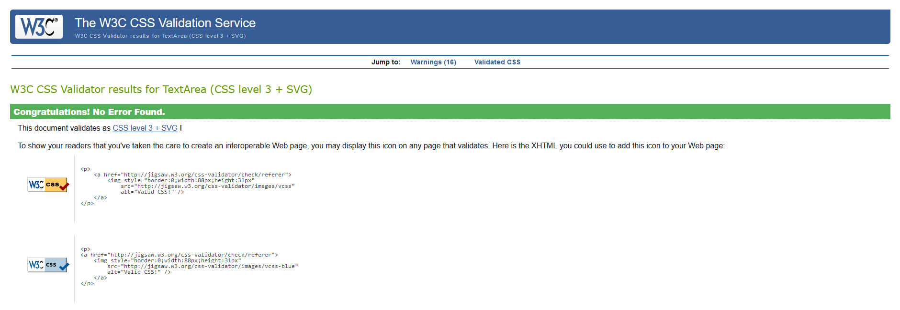
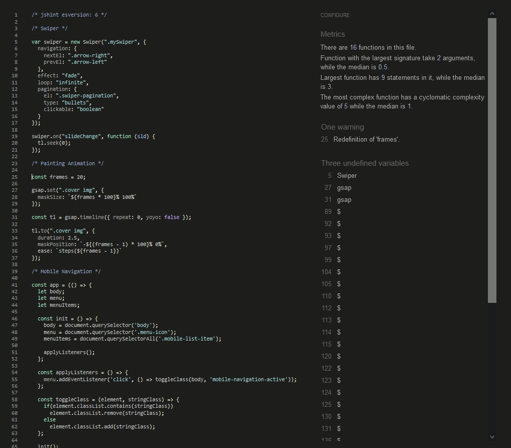

# Manual Testing

## Bugs

| **Bug**   | **Intended Outcome**  | **Issue**   | **Cause**   | **Solution**  | **Commit**  |
|---  |---  |---  |---  |---  |---  |
| #1  | SwiperJS's slide content (text and image) displayed side by side.   | SwiperJS's slide content (text and image) not displayed side by side.   | Slide content was not being put in a grid as the class name `.hero` was changed to `.hero-section` and only updated for the first slide.  | Change each slide's class from `.hero` to `.hero-section`.  | [732c182](https://github.com/Ryael/neon-shore/commit/732c182a2b0be3a29199a5b63985750f2d710146)  |
| #2  | Custom styles are used over SwiperJS's default styles.  | SwiperJS's default CSS,specifically, `display: block` used instead of custom `display: grid`.   | SwiperJS's styles had more specificity.   | Give custom CSS higher specificity by prefacing it with `.mySwiper`.  | [4c4c7d1](https://github.com/Ryael/neon-shore/commit/4c4c7d14a203250801ae3ca2708942ac70a31264)  |
| #3  | Search box on mobile should not have a `:hover` effect.   | Search box on mobile has a `:hover` effect.   | Mobile search box is a `li` element and all `li` elements have a `:hover` effect.   | Target all the `li` elements but the first, the search box.   | [e657d2b](https://github.com/Ryael/neon-shore/commit/e657d2b2427608a06db006489c3057806eeb21bd)  |
| #4  | When the mobile navigation menu is opened and a wider than expected viewport is achieved, the navigation switches to the wider resolution navigation.   | The mobile navigation menu is opened and then a wider than expected horizontal viewport is achieved. The close button disappears but the menu itself persists.    | `#fullscreen-navigation` isn't being toggled to `display: none` after the viewport is widened.  | Add `display: none` to `#fullscreen-navigation` to ensure the mobile menu doesn't display after viewports higher than specified.  | [2b4d04b](https://github.com/Ryael/neon-shore/commit/2b4d04ba4131721b3216f0453c8a657ea27799c2)  |
| #5  | Logo doesn't flicker upon transition into the mobile navigation menu.   | Logo flickers upon transition into the mobile navigation menu.  | Logo's transition is being covered by one of the other mobile navigation transitions.   | Adjust transition time to account for all transitions.  | [50dbef6](https://github.com/Ryael/neon-shore/commit/50dbef678a6869be2501b399eecdd3b41f99df3d)  |
| #6  | Footers stays at the bottom of the page.  | Footer detaches from the bottom of the page and displays a gap between it and the bottom of the page.   | `.container` sections did not have a viewport assigned in terms of height.  | Assign `height: 100vh` to `.containter` to ensure the footer is pushed to the bottom of the page.   | [ff0ae91](https://github.com/Ryael/neon-shore/commit/ff0ae918affdfcab5a540a835a76d617bde4a873)  |
| #7  | Category names should display as singular names.  | Category names are displaying as plural.  | The names are provided in `categories.json` are all plural.   | Add `singular_name` to `categories.json`.   | [8ef21ea](https://github.com/Ryael/neon-shore/commit/8ef21ea87b424d1510d32abe2db9e39a8ddc46b7)  |
| #8  | Mobile navigation links should only be interactable when the mobile menu is displayed.  | The mobile navigation links are interactable even when the mobile menu is not displayed.  | Mobile navigation links have `pointer-events: auto` by default.   | Toggle `pointer-events` from `auto` to `none` between transitions.  | [623e80a](https://github.com/Ryael/neon-shore/commit/623e80a7176bec539c7790c8f5f9034201d4e4d6)  |
| #9  | Navigation bar menu content should be centered.   | Navigation bar menu content is not centered.  | `padding` is pushing content to the right of center.  | Switch from `display: flex` to `display: grid` and use `grid-template-columns: 1fr 0fr 1fr` to completely center everything.  | [9245fc3](https://github.com/Ryael/neon-shore/commit/9245fc33a33f73d478a088dbf07f6ac65b6fd942)  |
| #10   | Upon item being removed from the bag, the page should automatically reload without any errors.  | Upon attempting to remove an item from the bag, the page reloads but a csrf error occurs.   | The csrf error prevents the item from being removed from the bag.   | Use `getCookie` code from Django documentation.   | [3021fa1](https://github.com/Ryael/neon-shore/commit/3021fa1be8afb7b874e30467a6b43d330712d7b6)  |
| #11   | Pagination for the home page should fit into the vertical viewport.   | Pagination for the home page doesn't fit into the vertical viewport.  | Container padding and margins are pushing the pagination out of view.   | Update container padding and margins to account for the pagination.   | [a0023a4](https://github.com/Ryael/neon-shore/commit/a0023a4b108d064d7e4d5848074bdab3f5b4800e)  |
| #12   | Flash messages should display special characters correctly.   | Flash messages are not rendering special characters properly.   | SweetAlert `text` field doesn't render special characters.  | Change SweetAlert `text` field to `html` field.   | [d7dc57d](https://github.com/Ryael/neon-shore/commit/d7dc57db9bcd44c734500fd708c46ebabc7a0fc1)  |
| #13   | Delivery cost should be calculated.   | Delivery cost is not being calculated.  | Delivery cost logic was not implemented.  | Import `Decimal` and add `delivery = total * Decimal(settings.STANDARD_DELIVERY_PERCENTAGE) / 100)` as the delivery logic.  | [fc99213](https://github.com/Ryael/neon-shore/commit/fc9921341d465e9f262d71e1309763ea6c1fc547)  |
| #14   | Page title for product details should be all lowercase.   | Page title for product details should be capitalised.   | `{{ product.name }}` is capitalised by default.   | Add `\| lower` to `{{ product.name }}` to ensure it's rendered as all lowercase.  | [6d53619](https://github.com/Ryael/neon-shore/commit/6d53619f3b63e41540c68694b8120603684f3733)  |
| #15   | Toast modal should not cover the navigation bar.  | Toast modal is covering the navigation bar, preventing the user from accessing their bag.   | Default SweetAlert style places the alert in the top right, which is where the navigation bar bag sits.   | Overwrite default style with custom by adding relative positioning for the modal.   | [9f6cb75](https://github.com/Ryael/neon-shore/commit/9f6cb75d95b0e9df3fc147fe8ce105768625aa52)  |
| #16   | Registered user can access their profile.   | Registered user was unable to access their profile.   | Error 500 was displayed, as migrations were not being run upon deployment to Heroku.  | Add a release phase command to procfile.  | [26c329b](https://github.com/Ryael/neon-shore/commit/26c329b4857e4a8a3eb35a4bee5c942fafb67467)  |
| #17   | Successful deployment to Heroku.  | Deployment was failing.   | `django-country` was missing a db-relation.   | Upgrade `django-countries`.   | [18498c8](https://github.com/Ryael/neon-shore/commit/18498c8355649aeb9c556c78ab03d374cd90a8d8)  |
| #18   | Heroku should use Python 3.11.6.  | Heroku was using 3.11.4.  | Heroku was using a previously built release.  | Add `runtime.txt` with Python 3.11.6.   | [e55b877](https://github.com/Ryael/neon-shore/commit/e55b877e852c3134e68277fc74926d2a350aa36b)  |
| #19   | Admin user can log into the website.  | Admin user was unable to log into the website.  | Admin had no user profile.  | Recreate admin user.  | N/A   |
| #20   | User can input payment details when checking out.   | User was unable to input payment details when checking out.   | jQuery CDN wasn't being loaded due to a security issue.   | Change `http` to `https` for the jQuery CDN, which is much more secure.   | [c2fa42e](https://github.com/Ryael/neon-shore/commit/c2fa42e5cf7f0d0584cc63e5cdeb4cb1ea3135f2)  |
| #21   | No horizontal scrollbar should be present across all content.   | Horizontal scrollbar is present across all content.   | `width: 100vw` on body and containers, in combination with the vertical scrollbar is what causes this.  | Remove `width: 100vw` from body and all containers.   | [0e1a7d4](https://github.com/Ryael/neon-shore/commit/0e1a7d417ac431155fdb8e9bb129273c0272e32a)  |
| #22   | Stripe webhook should deliver events successfully.  | Stripe webhook was not delivering events successfully.  | Stripe endpoint configured incorrectly.   | Add `/checkout/wh` to the end of the endpoint.  | N/A   |
| #23   | Stripe should send confirmation emails upon successful checkout.  | Stripe was not sending confirmation emails.   | Error 500, there was an extra newline in the subject confirmation email template.   | Remove the newline from the subject template.   | [dee11b4](https://github.com/Ryael/neon-shore/commit/dee11b40446f320ad7eabaeebe89785e4c2d7b7e)  |

### Unfixed:

- Some images and files not displaying due to an error 403 from AWS's end. This will be looked into later. One such image is the media "noimage". It seems to be an issue with permissions but as I'm largely unfamiliar with hosts like AWS, this was put aside in favor of other issues.

## Responsiveness

Mozilla Firefox's built-in Responsive Design Mode was to extensively test all aspects of Paradise Lost. It works on viewports as small as 350px.

## Accessibility

[WAVE WebAIM](https://wave.webaim.org/) was used to test the accessibility. A handful of label and aria-label errors were returned, as well as one constrast error but those were quickly fixed.

## Performance

Google Lighthouse was used to assess the performance of this website. All tests were performed in incognito mode to avoid interference from any other sources. Tests were carried out on each section but the same result was returned every time. This was the same case for mobile, and as such, only one result will be provided.

- Performance overall was poor, but this was to be expected with all the SVGs, transitions, and complex animations. This will the first thing to be rectified and optimised, as an e-commerce site that loads quickly is very important.
- SwiperJS's recommended HTML structure impacted the Accessibility score a bit but due to time constraints I have not had the opportunity to fix this, hence this will be looked into in the future.
- Lighthouse doesn't correctly detect the existing `robots.txt` file and the method of correcting unfortunately cannot be implemented due to time constraints.

## Validation

### HTML

[W3C Markup Validation Service](https://validator.w3.org/nu/) was used to validate all the HTML. Each file was checked by text input first and then by address afterwards. No errors were found, aside from errors pertaining to templating. A few errors were flagged but as they were svg warnings and those aren't parsed correctly, they were filtered.

### CSS

[W3C CSS Validation Service](https://jigsaw.w3.org/css-validator/) was used to validate both CSS stylesheets. No errors were found.

### JS

[JSHint](https://jshint.com/) was used to validate JavaScript code. It detected a few unused variables, specifically, `Swiper`, `gsap`, and `$`. The first two are imported from their own scripts and `$` is from jQuery.

### PEP8

[PEP8 Code Institute Linter](https://pep8ci.herokuapp.com/#) was used to validate Python code. The only errors found were to do with lines being too long and those were all fixed. Stripe's `webhook_hanlder.py` had some line too long errors but those were left alone in fear of tampering and breaking the webhook. `settings.py` had a handful of line too long errors but as they were provided that same way by the base template and for fear of tampering with important configurations, these errors were left untouched.

## Device Testing

The website was tested on many different devices, such as:

- Samsung Galaxy S10
- Samsung Galaxy S21
- Samsung Galaxy Note 8
- MSI GE72 6QF Apache Pro
- iPhone 8
- iPhone 10
- iPhone 11
- iPhone 11 Pro
- iPhone 12
- iPhone 14 Pro Max
- iPad Mini (Landscape and Portrait)
- iPad (Landscape and Portrait)
- Vivo S1 Pro
- LG v60
- Huawei P40 Pro
- Google Pixel 6

## Browser Compatibility

- Mozilla Firefox
- Google Chrome
- Opera
- Safari
- Microsoft Edge

I tested the website extensively on Mozilla Firefox, Google Chrome, and Microsoft Edge. For the remaining two, I asked friends and family to test the website on my behalf while overlooking it to ensure cross-compatibility. No issues or bugs were reported.

### User Story Testing

1. As an unregistered user, I want to quickly understand the purpose of this website so that I can determine if I want to continue spending my time on this website and register.

  - Upon arriving at the landing page, the user is greeted by the Swiper which allows the user to dynamically change the slides, showcasing 4 different products to them.
  - The typography helps to convey the feeling that this is a very contemorary, soft, and welcoming website which should help the user feel welcomed.

2. As an unregistered user, I want to easily navigate the menu without getting lost and see the uniformity of each page so that I know this website is worth my time and won't lead to any frustrations.

  - The colour scheme is consistent throughout all pages, as are the menus which emulate an gallery-like approach that help familiarise the user with the website.
  - The navigation menu is sleek, clean, and simple. Everything is well laid-out and easy to understand.

3. As an unregistered user, I want to quickly and easily learn more about the website and its purpose if I am unable to infer its purpose from the visuals and text alone, so that I can decide if registering for this website would be beneficial to me.

  - After this point, the user is able to navigate to the navigation menu if the visuals were engaging enough to open the "About" page, where they can find more detailed information about the purpose of this website in great detail.
  - Additionally, the user is able to quickly checkout the store and its product. If they're interested, they can registered to keep tabs on a list of their orders via the user profile.

4. As an unregistered user, I want to be able to register for an account so that I can view my past orders.

  - The navigation menu has a profile button that re-directs the user to the "Register" page, where they're able to easily and quickly make an account for the website.

5.  As an unregistered user, I want to be given feedback for my actions so that I know if they’ve been successful or not.

  - Upon every action, the user is either re-directed to the relevant page or SweetAlert flash messages appear in the top right of the screen informing if the user’s action has been successful or not, or even just displaying information.

6. As an unregistered user, I want to be engaged by the user interface, indicating I will enjoy spending time exploring the website as I navigate the same menus repeatedly.

  - The menus were all built in such a way that it feels cohesive and everything leads to another. Buttons are snappy and quick, with animations playing very quickly.
  - When one has to navigate lots of menus quickly, it’s equally important that said menus are well-designed and responsive.
  - The designs are also consistent throughout, with each part of the website complementing each other, emulating that sandy beach aesthetic.

7. As an unregistered user, I want to experience a unique and uniform design with appealing colours so that every part of the website stimulates a positive response.

  - The user interface was built with a very modern and sandy-beach theme in mind that’s supposed to evoke feelings of tropical shores with its buttons, hero-slider, and wave-like animations. Design was put on the forefront to engage the user as much as possible and maximise user conversion.

8.  As an unregistered user, I want to be able to access the website from any screen size and still have a pleasant viewing experience, so that I’m not restricted to only viewing this website on bigger screens.

  - This website has been optimised for all viewports, even for mobiles with widths as small as 370px.
  - Generally speaking, these sorts of websites tend to lend themselves well to bigger screens due to the amount of data they display, but this data has been styled in such a way that the data displays nicely even at smaller viewports.

9.  As a registered user, I want to be able to change my password should I forget it so that I have peace of mind in knowing that I won't be locked out of my account.

  - Upon navigation to the user profile, the user is presented with text documenting the features of their user profile. One such tab, account, will bring them to the part of their profile where they're provided options to reset their password or just change it.
  - Alternatively, if the user was logged out, once they navigate to the "Login" page by interacting with the user profile icon, and there'll be a link to "reset" their password in case they forgot at the bottom of the menu, which brings them to the same place as above.

10. As a registered user, I want to be able to manage my account by changing my password so that I can avoid any security breaches or implement a stronger password.

  - Registered users are able to open their user profile, which acts as their base of operations. Here they can find a "Change Your Password" button as part of the accounts tab, which re-directs them to the page of the same name. The user can change their password by first inputting their current password and their new, desired password twice.

11. As a registered user, I want to be made aware of my account management actions so that I know they have been successful.

  - Upon changing or updating their password, if the "Forgot Your Password" functionality was used then a page is displayed to inform the user's action was successful. If the "Change Your Password" functionality was used then a message is printed above the form to inform them that their password has been changed successfully.

12. As a registered user, I want to be able to access a user profile so that I have a base of operations for this website that's readily available.

  - Upon logging in or registering, the user is provided feedback that their action was successful via SweetAlert modal.
  - They are greeted here with a "Welcome, %username%!" to further inform that they're at the right place.
  - There are five buttons on the left side which act as tabs, which allow them to navigate to a) "Profile", b) "Details", c) "Orders", d) "Account", and e) "Wishlist" ("Admin" for admins) pages.
  - The "Profile" page is accessible from all parts of the website via the navigation menu once the user is logged in.

13. As a registered user, I want to be able to view a list of products so that I can select some for purchase.

  - Upon navigation to the store section of the website, the user is presented with all the available products.

14. As a registered user, I want to be able to view individual product details so that I can see their price, description, and a larger image to see if it's something I like.

  - While browsing the store page, the user can opt to interact with the "Buy Now" button or the image for any product that strikes their fancy.
  - Doing so will bring them to the detailed product view, where they can see additional details like the description, price, and a larger image.

15. As a registered user, I want to be able to view all my purchases to see how much my order has amounted to.

  - Navigating to the bag via the navigation menu will show the user everything currently in their bag, as well as the total price for the items.

16. As a registered user, I want to be able to leave a testimonial to let other people know of my experiences with this store.

  - By navigation to the testimonial tab in the navigation menu, users will be brought to a list of the latest 5 testimonials.
  - Here they're presented with a button to add their own testimonial, after which a short form is displayed in order for them to do so.

17. As a registered user, I want to be able to contact the store owner easily with any queries I may have.

  - The contact portion of the navigation menu is always visible to the user such that if they have any queries they are able to contact the store.
  - Upon navigating to it, they are presented with a very quick form so they can easily and quickly fill it out.
  - After it's been filled out and they click submit, a SweetAlert informs that their message has been received and will have a response within 48 hours.

18. As a registered user, I want to be able to change my delivery details so that they're correct and saved for future purchases.

  - After registration, the user may navigate to their user profile. Here, they're able to then navigate to the details tab, and this is where they're prompted for their delivery details.
  - Once saved, these will be saved for all future purchases, but they can be edited at any time either via this or via checkout.
  - If a user wants to make a purchase first, then all they have to do is follow the checkout process and then interact with the save details to profile box.

19. As a registered user, I want to be able to receive a verification email upon registration so that I know my registration was successful.

  - Upon successful registration, the user is sent an email asking them to verify their email.

20. As a registered user, I want to be able to receive a confirmation email upon completing a purchase so that I will have a copy of my order.

  - Upon successfully completing a purchase with Stripe, the user is sent a confirmation email via the Stripe webhook, which they can view at any time after.

21. As a registered user, I want to be able to sort products by their categories so I can quickly identify what I'm interested in.

  - Once the user is on the store page, they are presented with the available categories.
  - Should they choose to interact with any given one, every product associated with that category will be displayed to them.

22. As a registered user, I want to be able to search the list of products so that I can find anything I'm looking for as quickly as possible.

  - From anywhere within the website, the user has access to the search functionality.
  - Carrying out a search will bring up relevant products depending on what's input.
  - The user can even search by categories or description, should they wish to.

23. As a registered user, I want to be able to add a specific amount of a given product to my bag so that I can buy only the amount I'm looking for.

  - Once in the detailed view of a product, there is a button that allows users to choose precisely how much of a product they want to add to their bag.
  - This quantity can be increased, decreased, or input manually via the text box.

24. As a registered user, I want to be able to adjust the amount of a given product in my bag so that I can easily make changes to my overall order.

  - By navigating to their bag, the user is able to remove the product by interacting with the x button.
  - If they do not wish to remove it, but instead wish to adjust it, then they can adjust the quantity using the + and - buttons before confirming their choice with the tick button.

25. As a registered user, I want to be able to easily enter my payment information so that I can checkout quickly and securely and know that my payment information is safe.

  - After the user confirms they are happy with how their bag looks like, they may interact with the checkout button, which will bring them to the checkout page.
  - Here, the user is able to input their shipping details and payment information.
  - While the payment is processing, a spinning overlay appears over the checkout screen to indicate this.
  - The payment information is never stored and is handled by Stripe, which is a leading entity in the world of e-commerce payments. They're known for their security.

26. As a registered user, I want to be able to access the order success page after completing a payment to make sure it went through successfully and that I haven't made any mistakes in my shipping details.

  - As soon as an order is completed via the checkout page, the user is brought to the order success page, and a confirmation email is sent.
  - A SweetAlert modal message informs the user of this, and they are also able to view their order via the profile menu.

27. As a registered user, I want to be able to access the checkout page so that I review my order whilst entering my payment and shipping details.

  - Upon hitting checkout on the bag page, the user is brought to the checkout page.
  - This is where they're greeted by a shipping and payment form on the left side, and a summary of their order on the right.
  - The user is given ample time to fill out their order and review it at their leisure.

28. As an admin, I want to be able to add a new product to the store via the product management menu.

  - Upon navigating to the profile as an admin, the profile tabs on the left change slightly. "Wishlist" is now replaced by "Admin", as admins will have no need for a wishlist on their own store.
  - The description of the very first profile page informs the admin of their ability to add products and redirects them with a button.
  - Once they navigate to the add product menu, they are able to fill out a short form and upload an image to create a new product.

29. As an admin, I want to be able to edit a product by changing the product details via the product management menu.

  - For an admin to edit products, they must first navigate to the store where all the products are displayed.
  - Each product has two buttons on the far right: 1) an edit “pencil” icon and 2) a delete “bin” icon. 1) allows admins to edit products.
  - This can also be done via the detailed product view.

30. As an admin, I want to be able to delete the product, so that I can remove products that are out of stock or have been discontinued via the product management menu.

  - For an admin to delete products, they must first navigate to the store where all the products are displayed.
  - Each product has two buttons on the far right: 1) an edit "pencil" icon and 2) a delete "bin" icon. 2) allows admins to delete products.
  - This can also be done via the detailed product view.

31. As an admin, I want to be able to setup a social media page to promote my business, products, and website.

  - Due to expuella's existing social media accounts in Twitter, Weibo, and Pixiv, promoting her business will be no issue at all. This is especially true considering that she has a considerable following between these three platforms.

32. As an admin, I want to be able to access the users for the website so that I can make any adjustments to their accounts such as changing their password or email, should they request it.

  - By accessing the admin panel, an admin is able to quickly navigate to the "Accounts" or "Emails" section, where they make any necessary adjustments.

33. As an admin, I want to be able to view a list of the users so that I know how many active users there are.

  - Simply by navigating to the "User" portion of the admin panel, an admin is quickly and easily able to see exactly how many users have registered on their website and how many of them are active.

[Back to Readme](https://github.com/Ryael/neon-shore)
